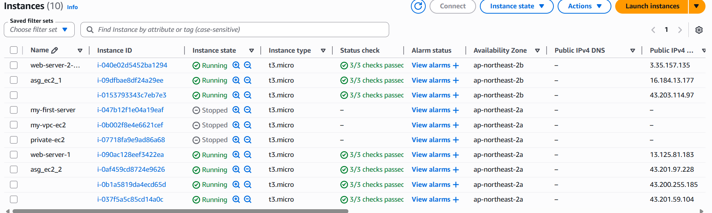
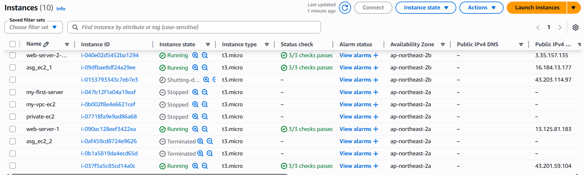

# Auto Scaling Scale Test

---

## 1. 실습 목적  

CPU 부하를 발생시켜 Auto Scaling의 Scale Out 및 Scale In 동작을 직접 확인한다.  

이를 통해 Auto Scaling이 어떤 기준으로 인스턴스를 늘리고 줄이는지 이해하는 것을 목표로 한다.

---

## 2. 실습 환경  

- AWS EC2  
- Auto Scaling Group  
- CloudWatch  
- stress  

---

## 3. 실습 목표  

- CPU 부하 발생  
- Scale Out 발생 확인  
- Scale In 발생 확인  
- Auto Scaling 동작 기준 이해  

---

## 4. 핵심 개념  

- **Scale Out**: 인스턴스 수 증가  
- **Scale In**: 인스턴스 수 감소  
- Auto Scaling은 개별 인스턴스가 아닌  
  **그룹 평균 CPU 사용률**을 기준으로 동작  

---

## 5. 전체 구조 (계층 구조)  

```
EC2 (CPU 부하 발생)
   ↓
CloudWatch (지표 수집)
   ↓
Auto Scaling Group (판단 및 실행)
```

---

## 6. 작업 과정  

### 6-1. EC2 접속  

내 PC:

```bash
ssh -i my-key.pem ubuntu@<EC2-IP>
```

---

### 6-2. CPU 부하 발생  

EC2 내부:

```bash
stress --cpu 4 --timeout 300
```

이 과정에서  
Auto Scaling은 단일 인스턴스의 CPU가 아닌  
전체 인스턴스의 평균 CPU를 기준으로 동작한다는 점을 이해했다.  

---

### 6-3. Scale Out 확인  

- EC2 → Instances에서 인스턴스 수 증가 확인  
- Target Group에서 새로운 인스턴스 등록 확인  

### 📸 EC2 인스턴스 증가 화면  



---

### 6-4. Scale In 확인  

EC2 내부:

```bash
pkill stress
```

- CPU 사용률 감소  
- Auto Scaling이 인스턴스를 감소시키는지 확인  

### 📸 EC2 인스턴스 감소 화면  



---

## 7. 확인 결과  

- Scale Out: 2 → 3 증가  
- Scale In: 3 → 2 감소  

---

## 8. 운영 관점  

Auto Scaling은 트래픽 증가 시 자동으로 확장하고  
트래픽 감소 시 불필요한 인스턴스를 제거하여 비용을 절감한다.  

---

## 9. 발생 가능한 문제  

1. CPU 부하 부족으로 Scale Out 미발생  
2. 한 인스턴스만 부하 → 평균 부족  
3. 반응 시간 부족으로 변화 확인 어려움  

---

## 10. 트러블슈팅  

- Scale Out이 발생하지 않음  
→ 두 인스턴스 모두에 stress 실행  

- 변화가 늦게 발생  
→ CloudWatch 지표 반영 지연(1~2분) 확인  

---

## 11. 배운 점  

Auto Scaling은 개별 인스턴스가 아닌  
그룹 평균 CPU를 기준으로 동작한다는 점을 이해하였다.  

또한 즉각적인 반응이 아닌  
일정 시간 지연 후 동작한다는 특징을 확인하였다.

---

## 12. 다음 단계  

- 장애 복구 테스트 진행  
