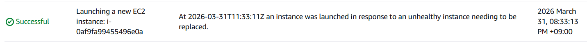
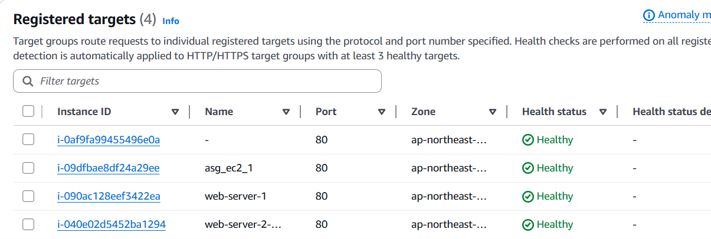

# Auto Scaling Failover Test

---

## 1. 실습 목적  

EC2 인스턴스 장애 상황을 가정하여  
Auto Scaling이 자동으로 인스턴스를 복구하는지 확인한다.  

---

## 2. 실습 환경  

- AWS EC2  
- Auto Scaling Group  
- Target Group  
- ALB  

---

## 3. 실습 목표  

- 인스턴스 강제 종료  
- Auto Scaling 자동 복구 확인  
- Target Group 재등록 확인  

---

## 4. 핵심 개념  

- **Failover (장애 복구)**  
  장애 발생 시 서비스가 중단되지 않도록 자동으로 복구하는 기능  

- **Instance Replacement**  
  기존 인스턴스를 복구하는 것이 아니라  
  새로운 인스턴스를 생성하여 대체  

---

## 5. 전체 구조 (계층 구조)  

```
Auto Scaling Group
   ↓
EC2 Instance (Terminate 발생)
   ↓
새로운 EC2 Instance 생성
   ↓
Target Group 자동 등록
```

---

## 6. 작업 과정  

### 6-1. 인스턴스 강제 종료  

EC2 → Instances → 인스턴스 하나 선택  

Instance state → Terminate  

이 과정에서  
Auto Scaling은 인스턴스를 보호하는 것이 아니라  
삭제 후 새로운 인스턴스를 생성한다는 점을 이해했다.  

### 📸 인스턴스 Terminate 실행 화면  


---

### 6-2. Auto Scaling 반응 확인  

- EC2 → Auto Scaling Group → Activity 확인  
- 새로운 인스턴스 생성 로그 확인  

### 📸 Activity 로그  



---

### 6-3. Target Group 상태 확인  

- initial → unhealthy → healthy 상태 변화 확인  

### 📸 Target Group 상태 변화  



---

## 7. 확인 결과  

- 종료된 인스턴스 자동 복구  
- 새로운 인스턴스 생성 및 Target Group 등록  
- 서비스 정상 유지 확인  

---

## 8. 운영 관점  

Auto Scaling은 장애 발생 시 자동으로 인스턴스를 복구하여  
서비스의 가용성을 유지하는 핵심 기능이다.  

---

## 9. 발생 가능한 문제  

1. ASG 소속이 아닌 인스턴스 종료  
2. health check 실패로 unhealthy 상태 지속  
3. nginx 미설치로 서비스 불가  

---

## 10. 트러블슈팅  

- unhealthy 상태 발생  
→ nginx 설치 및 실행 확인  

- 인스턴스 복구 안됨  
→ ASG 설정 및 Desired Capacity 확인  

---

## 11. 배운 점  

Auto Scaling은 기존 인스턴스를 복구하는 것이 아니라  
새로운 인스턴스를 생성하여 대체한다는 점을 이해하였다.  

또한 장애 상황에서도 서비스가 유지되는 구조를 직접 확인할 수 있었다.

---

## 12. 다음 단계  

- CloudWatch를 통한 모니터링 진행  
