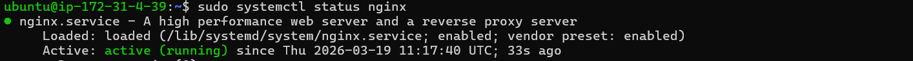

# EC2 + nginx Setup

## 1. 실습 목적

AWS EC2에 Ubuntu 서버를 생성하고  
SSH를 통해 접속한 뒤 nginx 웹 서버를 실행한다.

이 실습의 목적은  
**클라우드에서 리눅스 서버를 생성하고 웹 서비스가 가능한 상태까지 구성하는 기본 흐름을 이해하는 것**이다.

---

## 2. 실습 환경

- Cloud: AWS EC2
- OS: Ubuntu 22.04
- Instance Type: t3.micro
- Access: SSH
- Web Server: nginx

---

## 3. 구성 내용

- EC2 Ubuntu 인스턴스 생성
- 퍼블릭 IP 기반 외부 접속
- Security Group으로 SSH / HTTP 허용
- nginx 설치 및 실행
- 웹 브라우저를 통한 접속 확인

---

## 4. 작업 과정

### 4-1. EC2 인스턴스 생성

- Ubuntu 22.04 선택
- Instance type: t3.micro
- Key pair 생성
- Security Group 설정
  - SSH (22)
  - HTTP (80)

---

### 4-2. SSH 접속

```bash
ssh -i my-key.pem ubuntu@<public-ip>
```

- SSH를 통해 원격 서버에 접속

---

### 4-3. nginx 설치

```bash
sudo apt update
sudo apt install nginx -y
```

---

### 4-4. nginx 상태 확인

```bash
sudo systemctl status nginx
```

- nginx 서비스 실행 상태 확인

---

### 4-5. 웹 접속 확인

브라우저에서 접속:

```
http://<public-ip>
```

- nginx 기본 페이지 확인

---

## 5. 확인 결과

### SSH 접속 성공


- EC2 인스턴스에 정상적으로 접속

---

### nginx 실행 상태



- nginx 서비스 active (running) 상태 확인

---

### 웹 접속 성공


- 퍼블릭 IP를 통해 nginx 페이지 정상 출력

---

## 6. 운영 관점에서 중요한 이유

- EC2는 단순한 서버가 아니라 **클라우드 기반 운영 환경의 시작점**
- Security Group은 서버 접근을 제어하는 **네트워크 보안 장치**
- SSH는 서버를 관리하는 **기본 접근 방식**
- 웹 서버는 외부 사용자에게 서비스를 제공하는 **핵심 구성 요소**

즉,  
이 실습은 이후 모든 인프라 구성의 기본이 되는 단계이다.

---

## 7. 문제 / 트러블슈팅

### SSH 접속 오류

- 원인: pem 파일 경로 문제
- 해결: 절대 경로로 지정하여 접속

---

## 8. 배운 점

- EC2는 클라우드에서 제공하는 가상 서버이다
- SSH를 통해 원격 서버 관리가 가능하다
- nginx를 통해 웹 서비스를 제공할 수 있다
- 포트(22, 80)와 보안 설정이 접속에 직접적인 영향을 준다

---

## 9. 추가 개념 정리

### HTTP vs HTTPS

- HTTP: 80 (암호화 없음)
- HTTPS: 443 (암호화 적용)

HTTP는 데이터를 암호화하지 않기 때문에 보안에 취약하다.  
HTTPS는 SSL/TLS를 사용하여 데이터를 암호화한다.

이번 실습에서는 SSL 인증서가 없기 때문에 HTTP만 사용하였다.

---

## 10. 다음 단계

- Linux 파일 권한 (chmod)
- EC2 인스턴스 재생성 (복습)


