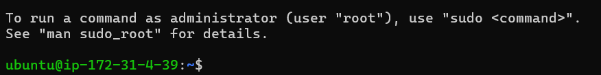
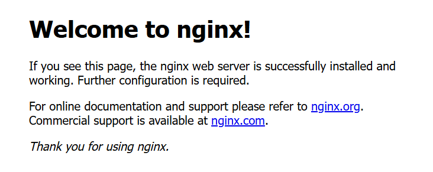

# EC2 Nginx Setup

## 목표

AWS EC2 서버를 생성하고 SSH로 접속한 후 nginx 웹 서버를 실행한다.

---

## 진행 과정

### 1. EC2 인스턴스 생성

- Ubuntu 22.04 선택
- Instance type: t3.micro
- Key pair 생성
- Security Group 설정
  - SSH (22)
  - HTTP (80)

---

### 2. SSH 접속

```bash
ssh -i my-key.pem ubuntu@퍼블릭IP

---

### 3. nginx 설치

```bash
sudo apt update
sudo apt install nginx -y

---

### 4. nginx 상태 확인

```bash
sudo systemctl status nginx

---

### 5. 웹 적속 확인

브라우저에서: http://http://43.203.120.208/
→ nginx 기본 페이지 확인

---

## 결과

### 1. SSH 접속 성공



EC2 인스턴스에 SSH를 통해 정상적으로 접속하였다.

---

### 2. nginx 실행 상태 확인


nginx 서비스가 정상적으로 실행 중(active (running))임을 확인하였다.

---

### 3. 웹 브라우저 접속 성공



퍼블릭 IP를 통해 웹 브라우저에서 nginx 기본 페이지가 정상적으로 출력되었다.

## 배운 점

- EC2는 클라우드에서 제공하는 가상 서버이다
- SSH를 통해 원격으로 서버에 접속할 수 있다
- nginx를 이용해 웹 서버를 구축할 수 있다
- Security Group은 서버의 방화벽 역할을 한다
- 포트(22, 80)를 열어야 외부 접속이 가능하다
- 서버를 생성하고 외부에서 접속 가능한 웹 환경을 직접 구성할 수 있다

## 추가 개념 정리

### HTTP vs HTTPS

- HTTP: 80 (암호화 없음)
- HTTPS: 443 (암호화 적용)

HTTP는 데이터를 암호화하지 않고 전송하기 때문에 보안에 취약하다.  
HTTPS는 SSL/TLS를 사용하여 데이터를 암호화하여 안전하게 전송한다.

현재 실습에서는 SSL 인증서 설정이 되어 있지 않기 때문에  
HTTP(80)만 사용하였고 HTTPS(443)는 사용하지 않았다.


